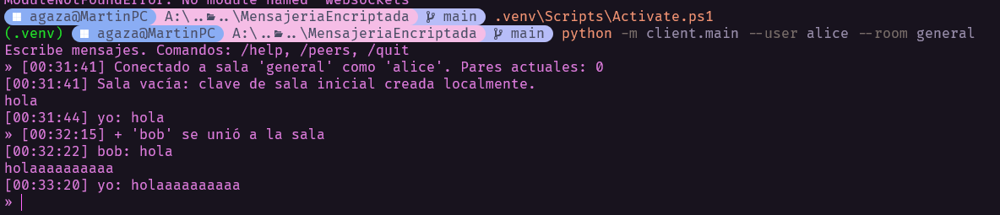
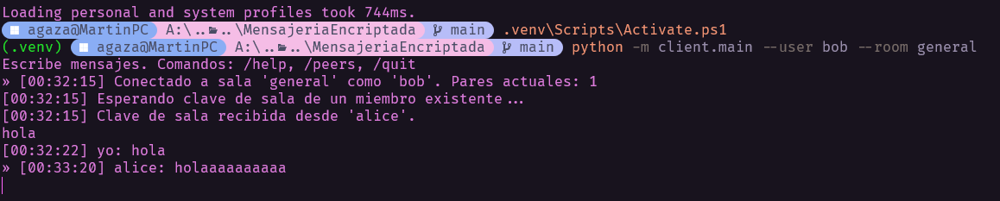
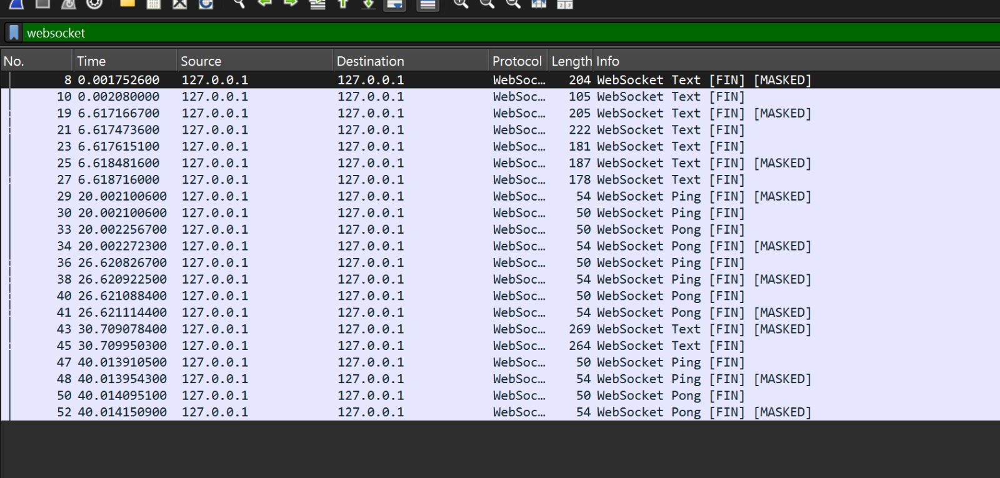
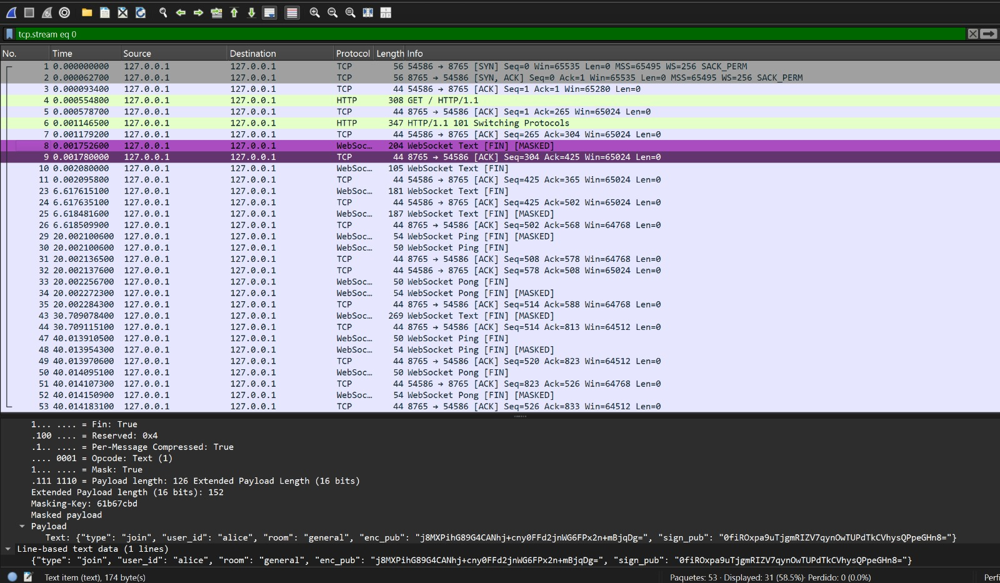
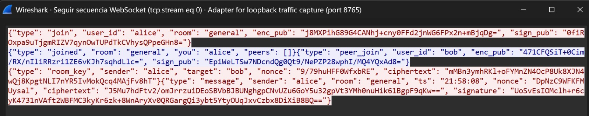

# Encry - Chat E2EE (MVP)

Este proyecto implementa un **chat de consola con cifrado End‑to‑End (E2EE)** utilizando WebSockets.

El objetivo del sistema es demostrar que los mensajes **solo pueden ser leídos por los clientes** que participan en la sala.  
El servidor actúa únicamente como **relay de mensajes** y nunca tiene acceso al contenido en texto plano.

---

# Arquitectura

- **Servidor (host)**
  - Maneja conexiones WebSocket.
  - Reenvía mensajes entre clientes.
  - No posee claves para descifrar contenido.

- **Clientes**
  - Generan sus propias claves.
  - Realizan intercambio de claves entre peers.
  - Cifran y descifran mensajes localmente.

Por diseño, el servidor solo observa **ciphertext**.

---

# Criptografía utilizada

El sistema utiliza primitivas criptográficas modernas:

| Algoritmo | Uso |
|---|---|
| X25519 | Intercambio de claves entre peers |
| Ed25519 | Firma de mensajes para autenticidad |
| AES‑GCM | Cifrado autenticado de mensajes |

Flujo simplificado:

1. Cada cliente genera claves de cifrado y firma.
2. Los clientes intercambian claves públicas.
3. Se deriva una **clave compartida**.
4. Los mensajes se cifran con **AES‑GCM** antes de enviarse.
5. El servidor solo retransmite los paquetes cifrados.

---

# Instalación

## Opción 1 — usando `pip`

Crear entorno virtual:

```bash
python -m venv .venv
```

Activar entorno:

**Linux / macOS**
```bash
source .venv/bin/activate
```

**Windows**
```bash
.venv\Scripts\activate
```

Instalar dependencias:

```bash
pip install -e .
```

---

## Opción 2 — usando `uv`

Sincronizar dependencias:

```bash
uv sync
```

---

# Ejecución

## 1. Levantar el servidor

Con pip:

```bash
python -m server.main --host 127.0.0.1 --port 8765
```

Con uv:

```bash
uv run server --host 127.0.0.1 --port 8765
```

---

## 2. Ejecutar cliente 1

```bash
python -m client.main --user alice --room general
```

o

```bash
uv run client --user alice --room general
```

---

## 3. Ejecutar cliente 2

```bash
python -m client.main --user bob --room general
```

o

```bash
uv run client --user bob --room general
```



---

# Comandos del cliente

| Comando | Descripción |
|---|---|
| /help | Mostrar ayuda |
| /peers | Listar peers conocidos |
| /quit | Salir del chat |

---

# Estructura del proyecto

```
client/
    main.py
    models.py
    runtime.py

server/
    main.py
    models.py
    runtime.py

crypto_utils.py
```

Descripción:

- **client/main.py** → CLI del cliente.
- **client/runtime.py** → lógica de red y cifrado.
- **server/main.py** → servidor WebSocket.
- **server/runtime.py** → relay de mensajes.
- **crypto_utils.py** → primitivas criptográficas compartidas.

---

# Verificación de privacidad con Wireshark

Para demostrar que el sistema cumple con la propiedad **End‑to‑End Encryption**, se capturó el tráfico de red utilizando **Wireshark**.

El objetivo de este análisis es verificar que:

- El servidor **no recibe texto plano**
- Los mensajes viajan **cifrados**
- Solo los clientes pueden descifrarlos

La captura se realizó monitoreando el tráfico en el puerto del servidor WebSocket.

---

# Captura 1 — Tráfico WebSocket




## Análisis

En esta captura se observa el tráfico WebSocket generado por la aplicación.

Los paquetes aparecen como:

```
WebSocket Text [FIN] [MASKED]
WebSocket Ping
WebSocket Pong
```

Esto confirma que:

- La comunicación entre cliente y servidor se realiza mediante WebSockets

- Los mensajes del chat se transmiten dentro de frames WebSocket Text

- El contenido del mensaje no es visible en esta vista, ya que Wireshark solo muestra el tipo de frame.

El uso de WebSockets permite mantener una conexión persistente entre cliente y servidor para transmitir mensajes en tiempo real.

---

# Captura 2 — Flujo TCP completo



## Análisis

En esta captura se sigue el flujo completo de la conexión TCP/WebSocket.

Se observa:

1. Handshake HTTP inicial
2. Upgrade a **WebSocket**
3. Intercambio de frames cifrados

El servidor no realiza ninguna operación de descifrado.

Los paquetes contienen únicamente:

- blobs cifrados
- claves públicas
- nonces

No se observa texto plano del mensaje enviado por el usuario.

---

# Captura 3 — Inspección del payload



## Análisis

Al inspeccionar directamente el payload del paquete WebSocket se observa un JSON similar a:

```
{
"type": "message",
"sender": "alice",
"target": "bob",
"ciphertext": "...",
"nonce": "...",
"signature": "..."
}
```

El campo `ciphertext` contiene datos aparentemente aleatorios.

Esto confirma que:

- el contenido del mensaje no es legible en la red
- solo el cliente que posee la clave puede descifrarlo

---

# Conclusión

El análisis de tráfico confirma que:

- Los mensajes **no se transmiten en texto plano**
- El servidor **no tiene acceso al contenido**
- La confidencialidad se mantiene gracias al cifrado **End‑to‑End**

Incluso teniendo acceso completo al tráfico de red, un observador solo puede ver **datos cifrados**, lo cual valida la propiedad de privacidad del sistema.
